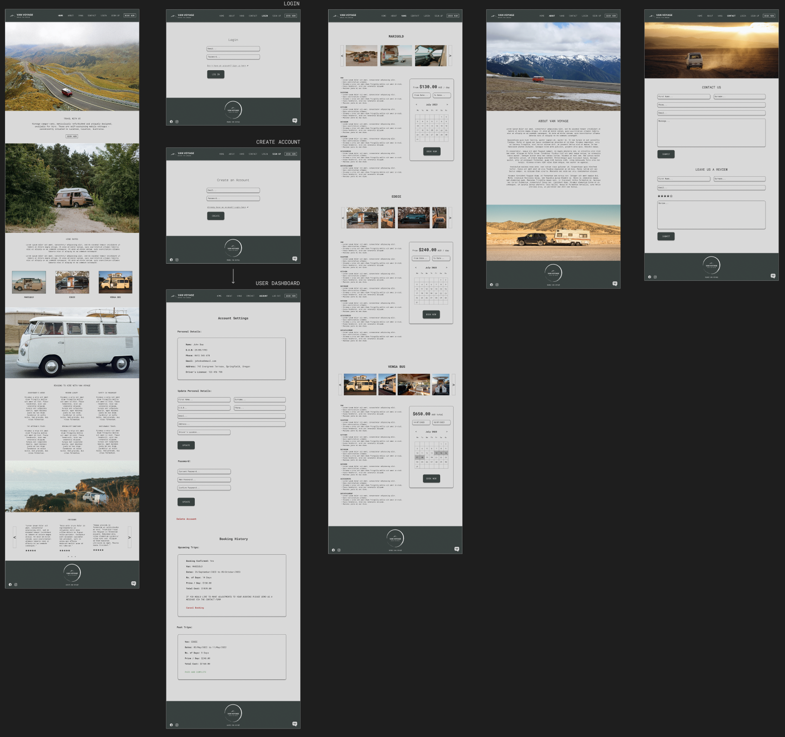
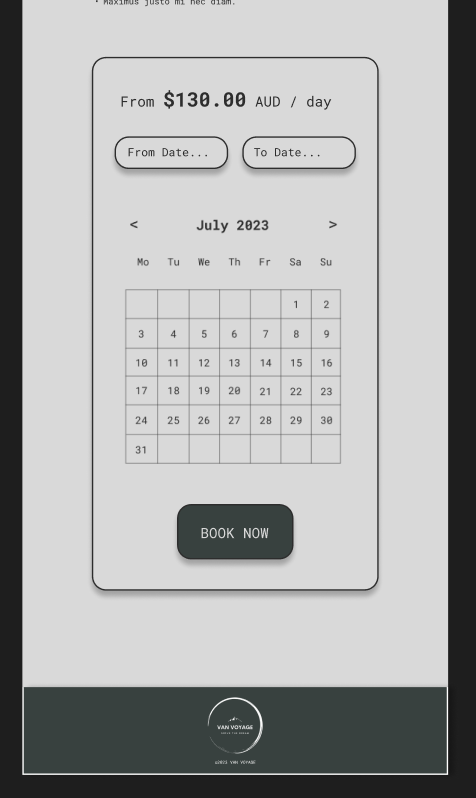
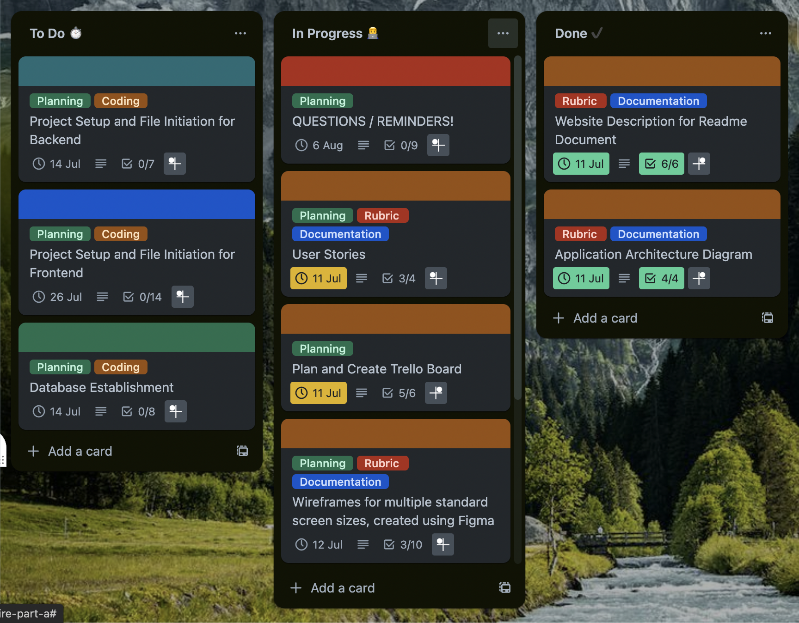

# T3A2 - PART A

   

 

# Van Voyage (Planning and Documentation)

[Part A - Docs](https://github.com/van-voyagers/T3A2-A-van-voyage-docs)  
[Part B - Client](https://github.com/van-voyagers/T3A2-A-van-voyage-docs)  
[Part B - Server](https://github.com/van-voyagers/T3A2-A-van-voyage-docs)

 

### Created by:

- [James Boland](https://github.com/JRBoland)
- [Jordan Aston](https://github.com/jordanaston)

 

## Purpose:

The purpose of this application is to facilitate the operation of a hypothetical business that rents out a small fleet of vintage, refurbished camper-vans. It aims to provide a user-friendly platform where customers can conveniently book camper-vans and view their availability in real-time. The application is designed to cover new user registration, profile management, booking logs, availability tracking, and booking confirmation. It is intended to have an inbuilt review system, fostering a transparent and interactive space for customers to share their experiences.

The application is required to be scalable and extensible, built with the potential to integrate additional features or modules in the future, such as search filters, personalised recommendations, payment system, live chat messaging, admin dashboard and an instagram carousel.

 

## Target Audience:

The application's target audience is broad and inclusive, designed to cater to anyone with an interest in hiring vintage camper-vans. This could range from individuals planning a unique weekend getaway, families seeking an alternative vacation experience, to aficionados of vintage vehicles who relish the opportunity to experience these refurbished camper-vans.

While the application will be designed with ease of use in mind, it will cater to both tech-savvy users who are comfortable navigating digital platforms, and less tech-oriented individuals who may require a simpler, more intuitive user interface.

 

## Functionality & Features:

### **User Onboarding**

- **Account Creation:** Users can register for an account via a straightforward sign-up process that only requires email and password.

- **Logging In:** A dedicated login page provides secure access to users' accounts with email and password for verification.

- **User Profile / Account Page:** After creating an account, users can manage their personal profile by updating details such as email, password, first name, last name, phone number, address, date of birth, and license number. Here they also have the ability to delete their account.

- **Logging Out:** Users can securely log out of their accounts when they're done with their session, ensuring their data remains secure.

### **Van Browsing**

- **Van Details View:** Each vintage van is given its own section with an image carousel, details of van features and pricing that updates when dates are selected.

- **Real-time Availability Check:** Users can immediately see whether their chosen van is available for their preferred dates via a dynamic calendar.

### **Booking/ Contact System**

- **Select Van / Date / Duration:** Users can easily select their van of choice, specify their rental duration, and see the total cost of the booking prior to confirming.

- **Booking Confirmation:** Users will be able to see the details of their booking in their accounts page with the ability to cancel the booking if needed.

- **Contacting Van Voyage:** If users need to contact the business for any reason such as updating booking details or account issues, they can do so via the contact form on the contact page.

### **Admin CRUD (Postman)**

- **User Management:** Admins can manage all user accounts, including creation, deletion, and updates.

- **Van Management:** Admins have full control over van details like pricing and availability.

- **Booking Overview:** Admins can access and manage all bookings in the database.

- **Reviews:** Admins have complete control over any reviews posted to the website.

### **Review System:**

- **Post Booking Reviews:** Users can share their experiences and thoughts after their booking is confirmed. Reviews consist of a start rating and a comment.

- **Featured Reviews Carousel:** The most recent reviews are dynamically displayed in a carousel on the home page.

 

## Tech Stack:

 

### **Frontend:**

&nbsp;&nbsp;&nbsp;

 

### **Backend:**

&nbsp;&nbsp;&nbsp;&nbsp;&nbsp;&nbsp;

 

### **Testing:**

 

### **Design:**

 

### **Deployment:**

&nbsp;&nbsp;&nbsp;&nbsp;&nbsp;&nbsp;

 

## Application Architecture Diagram:

 
 

## Data Flow Diagram:

 
 

## User Stories:

_User stories may contain ~~strikethroughs~~, indicating revision._

**Format:**

Story #:

_As a [ persona ], I want to [ __ ], so that [ __ ]._

Acceptance Criteria:

- Requirements to complete a user story.

Definition of done:

- ‘Ultimately, the user story is considered complete when…’

---

User personas are included to consider the different ways or approaches different users may take to using the website.

_Click the dropdowns below to view user stories and user personas._

<h3>User Personas</h3>

Potential User

### **Potential user (AKA: unregistered user, “browsing” user)**

  - Melanie: Retiree / 62
    - Not very technologically savvy. Needs a clear way to browse available vans and instructions on how to book.
  - Jack: Student / 22
    - Wishes to book a van so that he and his partner can go on a road trip for a weekend trip. May be planning to go onto dirt roads/camping locations so will need a suitable van.
  - Chad & Stephanie: Couple / late 20’s
    - Wishes to browse vans and their interior in detail so that they can find a van that fits their ‘aesthetic’.
  - Jerry: Banker / 31
    - Wishes to compare the pricing of hiring a van as they are tossing up between a few different rental options.
  - Jeremiah: Arborist / 29
    - Wants to find contact information so that they can call or email the business with further, specific questions as well as confirm the legitimacy of the site. Wants to be able to check reviews as a way of finding out more about the business from the customer’s perspective.

- The following “potential user” personas were removed with the **first** iteration of revised user stories:

  - ~~Jill: Mum / 35~~
    - ~~Wishes to browse vans so that she can see if there is a van available that will be suited for her, her partner, and her 18 month old baby.~~
      - _The user story for “Jack” meets the same requirements of the user being able to view the van description. The current version of MVP does not include additional extras (such as baby seats or bedding)._
  - ~~Jay: Film director / 29~~
    - ~~Wants to check out the legitimacy of the site (instagram carousel, reviews)~~
      - _Legitimacy may be checked via contact information, reviews added to “Jeremiah” user story. Instagram carousel removed from MVP and is considered as a N2H._

Registered User

### **Registered User (AKA: existing user, returning user)**

  - Jarrod: Plumber / 32
    - Wants to be able to compare pricing and availability of dates that are available for booking, to plan their week off from work.
  - Jared: Sparkie / 33
    - Wants to be able to receive confirmation of expected cost before finalising the booking.
  - Jacquie: Teacher / 26
    - Wants to post a review after her experience with the business
  - John: Student / 25
    - Wants to have some control over their profile settings and to be able to view and manage their current bookings

- The following “registered user” personas were removed with the **first** iteration of revised user stories:

  - ~~Greg: Tutor / 41~~
    - ~~Has previously registered but has forgotten their password. Wants to recover their password.~~
      - Not in current MVP.
  - ~~Julie: CEO / 49~~
    - ~~Has a very busy schedule and is fairly disorganised. Wants to receive booking confirmation with dates and all relevant information so that she can forward it to her assistant (to block her calendar? idk haha) without little interference.~~
      - Not in current MVP, email notification moved to N2H.

Admin User

### **Admin User (AKA: business user, vendor)**

  - Vance: Business owner / 38
    - Wants to be able to add, edit and delete vans and their details (including pricing, image, description, availability, etc.) from the fleet that is available on the site.
  - Vanessa: Business partner / 38
    - Wants to be able to view relevant details of all registered users, as well as the ability to delete bot/spam user accounts.

<h3>User Stories</h3>

Potential User

### **Potential User:**

Story 1:

_As a potential user, I want to be able to browse the available vans and their details without having to create an account, so that I can make an informed decision on whether to proceed with the booking._

Acceptance Criteria:

- Individual van page to display responsive, informative, text and image content, including various images from different angles of the same van.
- Each van (object in the database) to hold details of the van, posted by the admin user.
- Vans and their details are to be viewable without authentication (or authorisation).

Definition of done:

- A user is able to browse vans without any required authentication.

Story 2:

_As a potential user, I want to be able to navigate the website easily, so that I may understand more about the business._

Acceptance Criteria:

- Each page on the website displays accessible, responsive, informative, text and image content and action buttons.
- The website should adhere to suitable UI/UX and accessibility standards, with a clear layout and clean, readable labels.
- Clearly labeled and accessible site navigation across devices.

Definition of done:

- The website adheres to UI/UX and accessibility principles. The content displayed is readable and intuitive.

Story 3:

_As a potential user, I want to be able to easily sign up, so that I may make a hassle-free booking._

Acceptance Criteria:

- New user registration/sign-up form; clear instructions on how to do so for each step.
- A new user can not submit a registration form unless necessary fields are filled out.
- Information from the form to be used to create a new user, and then stored in the database.
- ~~Confirmation email~~

Definition of done:

- A potential user is able to create and register their account and complete a booking. The newly created user is to be added to the database.

Story 4:

_As a potential user, I want to find out more information about the business, so that I can ensure the site and business are legitimate._

Acceptance Criteria:

- Easily accessible contact information/page, with resources on how a potential user may contact the business (contact form, email, number, mock ABN).
- Reviews from other users.
- Displayed accessible social media presence, ~~Instagram~~.

Definition of done:

- Reviews are displayed and external business links (eg. ~~Instagram~~).

Registered User

### **Registered User**

Story 1:

_As a (not currently logged in) registered user, I want to be able to log into my account, so that I’m authorised to book a van._

Acceptance Criteria:

- Login button is accessible via all main pages that takes the user to the login form.
- Login form with email and password placeholder text.
- Authenticated and authorised users (All authenticated users are authorised to book a van unless they do not have a valid license)
  - Potential additional criteria (currently all N2H):
    - Authorisation requires email confirmation
    - “Remember me?” button and function on the login form.
    - “Forgot your password?” button (and the process that follows) on the login form.

Definition of done:

- Users can log in.

Story 2:

_As a registered user, I want to be able to book a van between certain dates, so that I can hire the van for the selected timeframe._

Acceptance Criteria:

- Ability to complete the booking process for a specific van for set dates.
- Booking form with calendar date blocks.
- ~~A confirmation email with further hire information.~~
- Other users are unable to book dates in which a van is hired out.

Definition of done:

- User can book their desired van, checking the availability by date. ~~User to receive information confirmation~~. User’s “Upcoming Trips” (under bookings) section in Account page to reflect newly added booking. Information to be updated in the database.

Story 3:

_As a registered user, I want to be able to update my personal information, so that it may reflect any changes I make to my address, email, etc._

Acceptance Criteria:

- User panel (Account Settings on Account page) in which the user has full CRUD over their account information. Some information to remain locked to the account (email, D.O.B, and name)
- Mandatory fields to require information.

Definition of done:

- User can update their personal information, with the user’s information in the database reflecting the change.

Story 4:

_As a registered user, I want to be able to view and manage my bookings, so I can confirm the dates and plan my trip._

Acceptance Criteria:

- Booking History panel on the Account page to show upcoming and previous booking information, such as dates, total cost, and van name.
- The user is able to cancel a booking from the Booking History panel.
- Text indicating that users can make changes to their booking by contacting the business.

Definition of done:

- User can view their bookings from the account page. User can manage or has instruction on how to manage their bookings. Bookings to display relevant information.

Story 5:

_As a registered user, I want to be able to log out of my account, so that I can end my session._

Acceptance Criteria:

- Logout button that signs the current user out.
  - Potential additional criteria (currently N2H):
    - If in the booking stages, or if in the process of any other action (cancellation, updating information) popup informs the user that logging out will not save their progress.

Definition of done:

- Users can log out.

Admin User

### **Admin User (Business User)**

_(Business/Admin User to have same user story as Registered User stories 1 & 5 (logging in and out))_

Story 1:

_As a business admin user, I want to be able to update my van inventory and their details, so that the vans and their information displayed are accurate._

Acceptance Criteria:

- Admin-level authentication to have authorisation for full CRUD over the van objects stored within the database.
  - Considering the the timeframe and current state of MVP, the admin is to perform CRUD operations through Postman.
- Van objects with their information to be stored in MongoDB, certain properties to have data type validation (dates, prices(integer), etc.).
  - MongoDB is to be connected to the front end (built with React) to accurately reflect and display the vans information

Definition of done:

- Admin user has full CRUD over objects within the database, with changes made updating in the front end.

The following user story has been removed during the **first** iteration of the User stories (Email confirmation moved to N2H):

Story 2:

_~~As a business admin user, I want to be able to receive notice of any bookings made, so that I may record and manage them.~~_

~~Acceptance Criteria:~~

- ~~Upon booking made by a regular user, the admin user is to receive an email with information about the booking.~~

~~Definition of done:~~

- ~~Admin user receives notice of a booking and its details.~~

 

## Wireframes:

### DESKTOP

 

### TABLET

 

### MOBILE

 
 
 
 
 
 
 

   

### WEBSITE FLOW & NAVIGATION

 

 

## [View Wireframes In Figma](https://www.figma.com/file/BemCVUbQDxPoxBus4lTpCc/Van-Voyage?type=design&node-id=0-1&mode=design&t=GJJb0HInyCqr9ETQ-0)

 

## Design Iterations for Wireframes (Agile)

### **Navigation and Flow:**

- Initially, the wireframe design consisted of just a 'Vans' button in the navigation bar, leading users to the vans page for making a booking. Feedback led to the addition of a 'Book Now' button in the navigation bar and a prominently placed one on the home page, providing quicker access to the booking section. This improved the navigation flow by giving users a direct route to start booking a van.

- In the original design, van information was only accessible through the 'Vans' page. To improve user flow, images of the three vans were added as clickable buttons on the home page, leading directly to the respective Van detail pages. This change provided users with a direct path to the details of the van they are interested in.

- The login and create account forms were initially located on the same page, potentially causing confusion for the user. To improve flow, these were split into individual 'Login' and 'Signup' pages, ensuring a more intuitive path for users either returning to the site or signing up for the first time.

- The mobile view initially displayed all vans listed down the Vans page. To streamline the mobile navigation flow, this was replaced with a dropdown menu allowing quick access to individual van details, reducing the number of steps a user would have to take to find information on a specific van.

### **Layout and Positioning:**

- In the initial design of the vans page, the images of the van were displayed in a vertically cascading manner, taking up a lot of space on the page and requiring the user to scroll to see all the content. The layout was revised to include a carousel for the images, consolidating space and making it easier for the user to view other details on the same screen.

- The van details and booking calendar on the vans page were originally positioned so that the calendar was underneath the van details, requiring the user to scroll down to view available dates. To enhance the user experience and reduce scrolling, the layout was adjusted so that the calendar was positioned beside the van details. This allowed users to view the van details and available dates simultaneously.

- Initially, the social media links were located in the top navigation bar. After several iterations, these links were moved to the footer to reduce clutter in the navigation bar and to place more emphasis on other essential navigation links and buttons.

- The reviews section on the home page was initially positioned higher up on the page. After iterating, we realized that this section was not as critical as others to be seen so prominently, so it was moved to the bottom of the page. This also gave higher visibility to other, more critical sections on the home page.

### **Element Design:**

- Initially, there were not as many images of vans and scenic locations on the home page. After several iterations, we decided to add and enlarge these images to help users visualize the idea and concept of the business, providing a glimpse into what a getaway trip with Van Voyage might look like.

- Over time, we shifted the color scheme towards natural, muted hues like greens and beiges. This decision was made to align the website's overall aesthetic more closely with the business's objective of providing nature-focused van trips.

- In the first iteration of the wireframe design, we had a sticky footer. However, given the growing amount of information on the page and the non-essential nature of the footer content, we decided to switch to a non-sticky footer. This change improved the overall user experience by ensuring the most important information was front and center.

### **Adding / Removing Features:**

- Based on early feedback, we realised that users would want to be able to view the booking history easily. Therefore, we added a "Booking History" section to the user's account dashboard instead of it being seen via email. This also meant that we could handle the cancel booking feature here as well.

- For a more intuitive experience, we decided to implement conditional rendering for the Login, Sign Up, Account, and Log Out buttons in the navigation bar. This means that the user will see "Login" and "Sign Up" buttons when they are not logged into the site. Once they log in, these buttons will switch to "Account" and "Log Out". This dynamic adjustment provides a more tailored user experience and intuitively guides users to relevant sections based on their authentication status. 

- The initial design concept included an Instagram carousel at the bottom of the homepage, which aimed to showcase real-time updates and user experiences. It was thought that this would lend authenticity and vibrancy to the website. However, during the process of user feedback and further development, it was determined that this feature wasn't contributing significantly to the overall user experience.

## Planning (Trello):

### [View Trello Board](https://trello.com/b/RtrOpaLV/ca-retro-van-hire-part-a)

 

 
 
 
 
 
 

 

## References:
